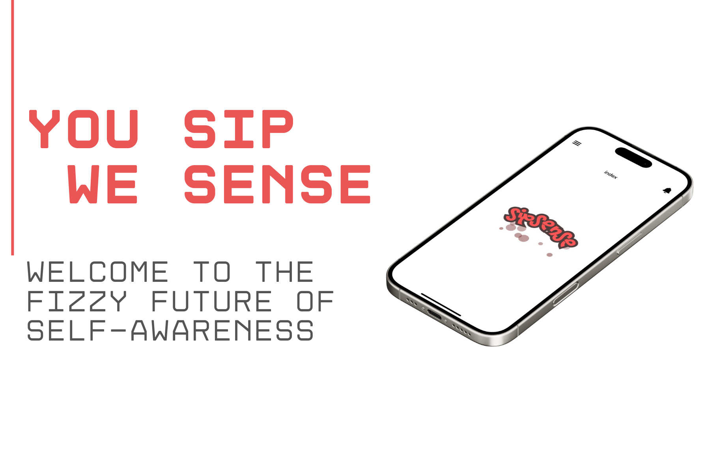
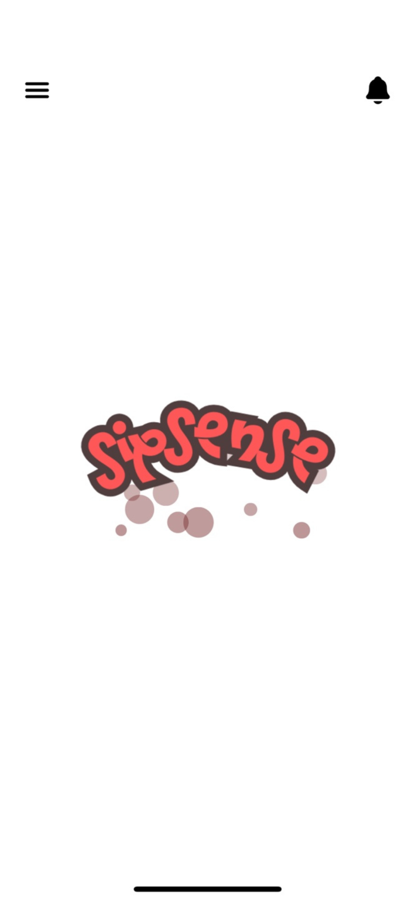
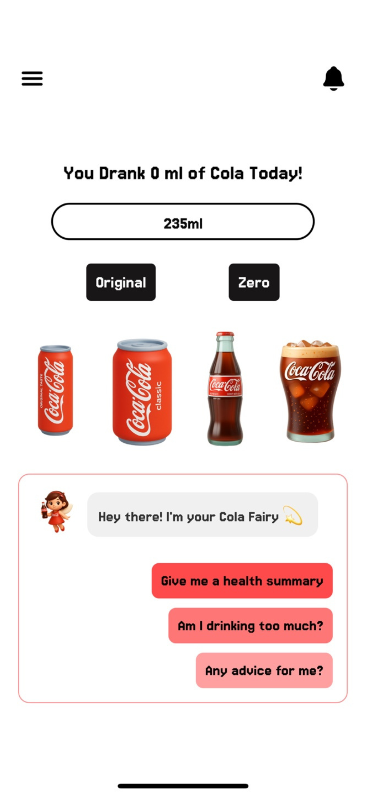
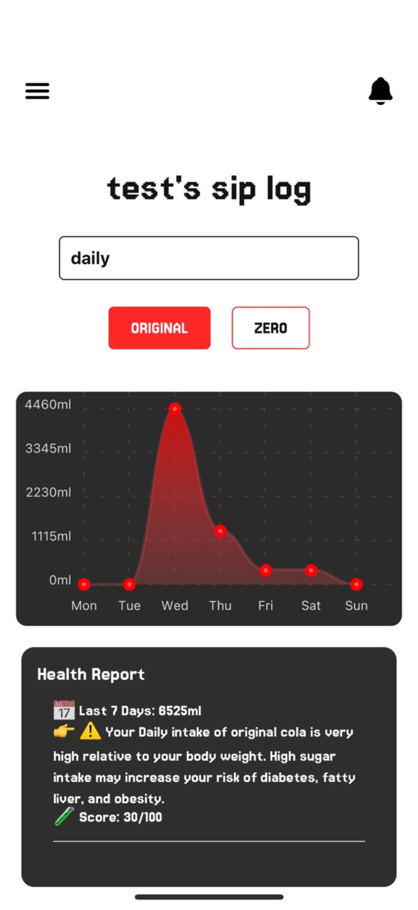
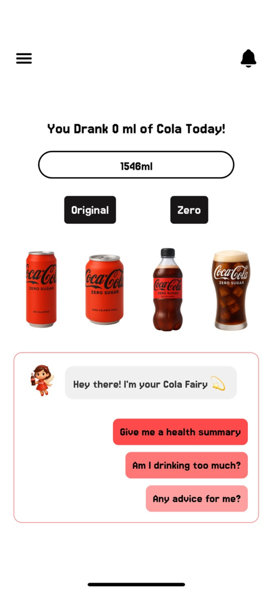

# 🥤 SipSense App (Frontend)



SipSense is a simple and fun app that helps you monitor your daily cola intake.

## 🥤 Why SipSense?

- Keep track of how much cola you drink each day
- Fun animations and chatbot responses
- Simple history graph to see your progress
- Notifications if you’ve been inactive for too long

---

## 🚀 Features

- ✅ **User Signup & Login** with JWT
- 🥤 **Cola Intake Logging** (Original / Zero)
- 📊 **Animated Visualization** – Cola bar fills as you drink
- 🤖 **ChatBot Reactions** based on your intake level
- 📈 **Graph-Based Insights** for daily, monthly, and yearly patterns
- 🔔 **Inactivity Notifications** (after 3 hours of app inactivity)
- 🧑‍💼 **Profile Editing & Preferences**
- 🌐 **Backend API Integration** with EC2-hosted Express server

---

## 🛠️ Tech Stack

| Area       | Technology                                   |
|------------|----------------------------------------------|
| Framework  | React Native (Expo + expo-router)            |
| State      | Zustand                                      |
| Charting   | react-native-chart-kit                       |
| Auth       | AsyncStorage + JWT                           |
| Network    | Axios                                        |
| Routing    | expo-router                                  |
| Notifications | expo-notifications                        |
| Deployment | EAS Build & Submit to App Store              |

---

## 📁 Folder Structure (Simplified)

```
cola-calc-app/
├── app/                            # App screens, routes, logic
│   ├── components/                 # Reusable UI components
│   │   ├── ChatBot.tsx
│   │   ├── DropDown.tsx
│   │   ├── Loading.tsx
│   │   ├── SideBar.tsx
│   │   └── TopBar.tsx
│
│   ├── store/                      # Zustand stores (global state)
│   │   ├── authStore.ts
│   │   ├── notificationStore.ts
│   │   ├── useChatFlow.ts
│   │   └── useGlobalLoading.ts
│
│   ├── api/                        # Axios API functions
│   │   ├── axios.ts                # Axios base instance
│   │   ├── auth.ts                 # Auth API calls
│   │   ├── cola.ts                 # Cola intake API calls
│   │   └── notification.ts         # Notification API calls
│
│   ├── _layout.tsx                 # Global layout component (expo-router)
│   ├── index.tsx                   # Main screen
│   ├── home.tsx                    # Home screen
│   ├── signup.tsx                  # Signup screen
│   ├── profile.tsx                 # Profile edit page
│   ├── siplog.tsx                  # Graphs for intake history
│   ├── settings.tsx                # User Notification settings page
│   ├── notificationsList.tsx      # Notification history screen
│
├── assets/                         # Static files (images, fonts, etc.)
│
├── utils/                          # Helper utility functions
│   ├── caculator.ts                # Cola ml calculation logic
│   ├── fillTemplate.ts             # ChatBot template logic
│   ├── getMonthCount.ts            # Monthly cola aggregation
│   ├── getWeekCount.ts             # Weekly cola aggregation
│   ├── getYearCount.ts             # Yearly cola aggregation
│
├── .env                            # Environment variables (API URL, etc.)
├── .gitignore                      # Git ignore rules
├── app.config.js                   # Expo dynamic configuration
├── app.json                        # Static config for iOS (App Store)
├── eas.json                        # EAS build profiles
├── eslint.config.js                # ESLint setup
├── package.json                    # Dependencies and scripts
├── tsconfig.json                   # TypeScript configuration
└── README.md                       # Project documentation (frontend)

```

---

## 📲 Getting Started

```bash
# 1. Clone the repo
git clone https://github.com/Raina-Moon/cola-calc-app.git
cd cola-calc-app

# 2. Install dependencies
npm install

# 3. Run the project
npx expo start
```

---

## 📸 Screenshots

| Main | Home | Graph | ChatBot |
|------|------|-------|---------|
|  |  |  |  |

---

## 📲 Download

> Available soon on the App Store

---

## 👤 Author

**Raina Moon**  
[https://raina-moon.com](https://raina-moon.com)

---

## 📄 License

MIT License
